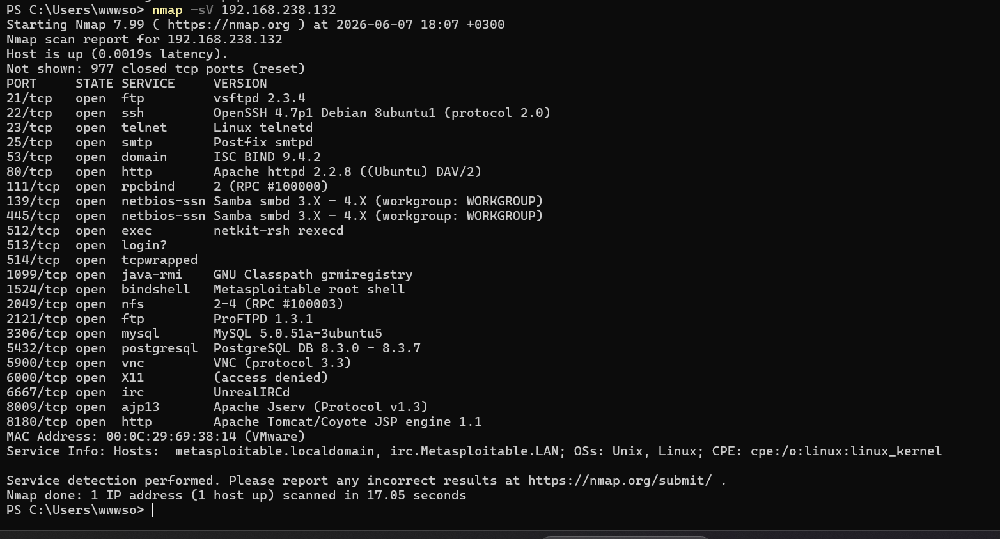
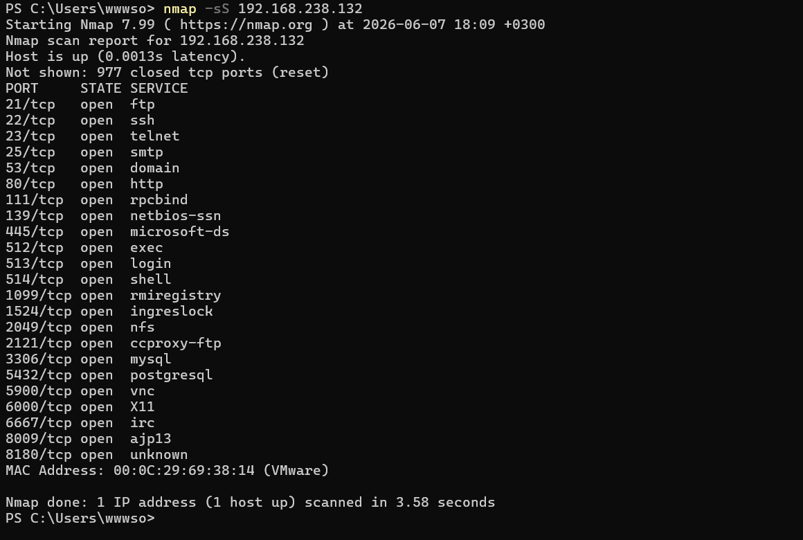
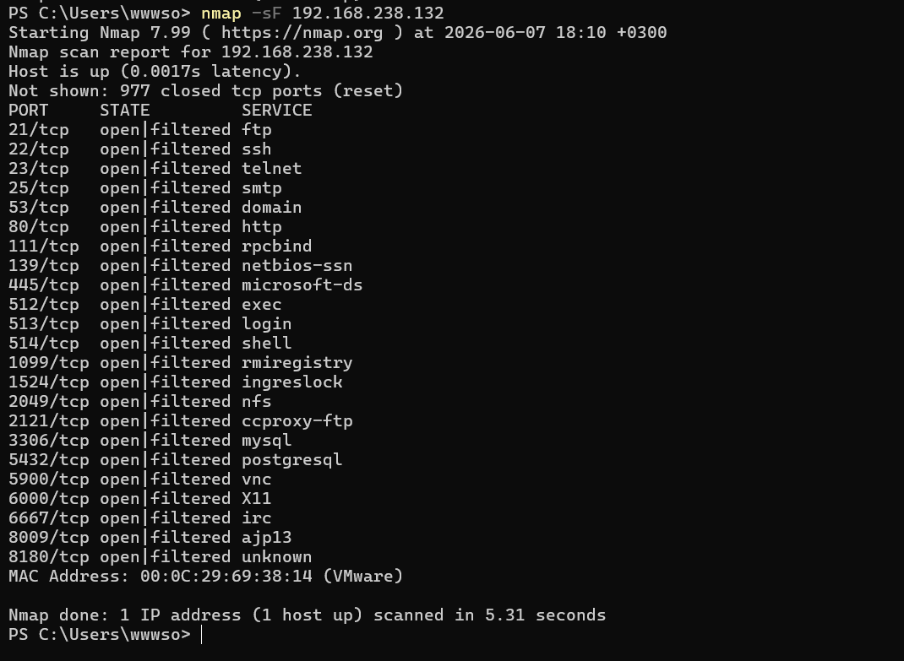
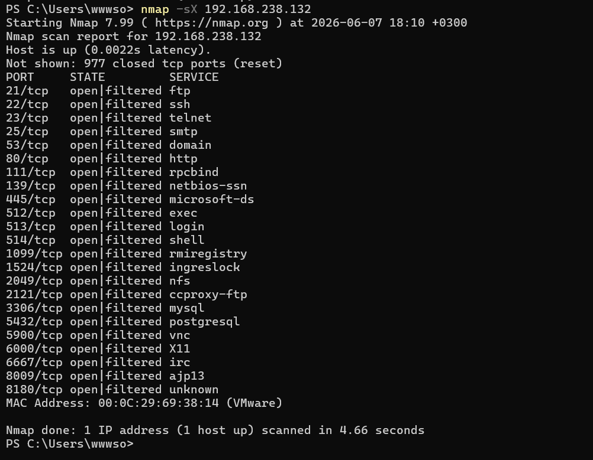
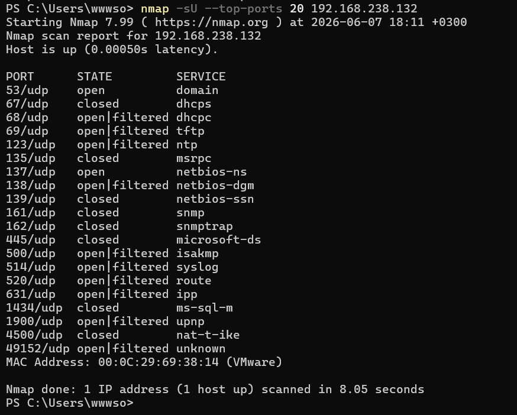
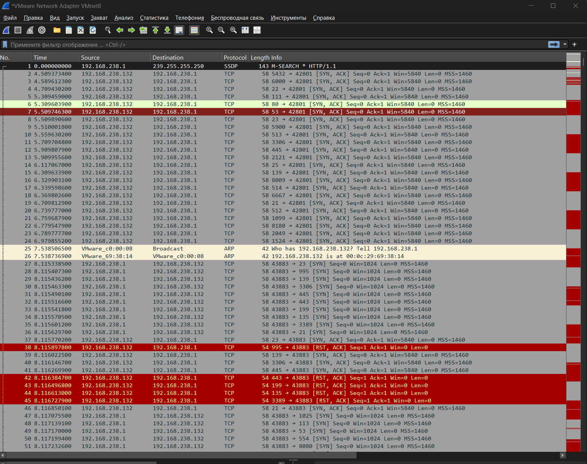
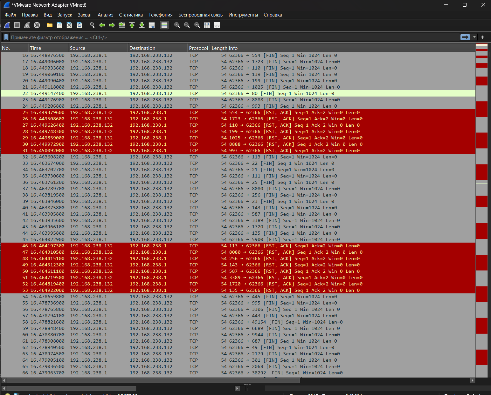
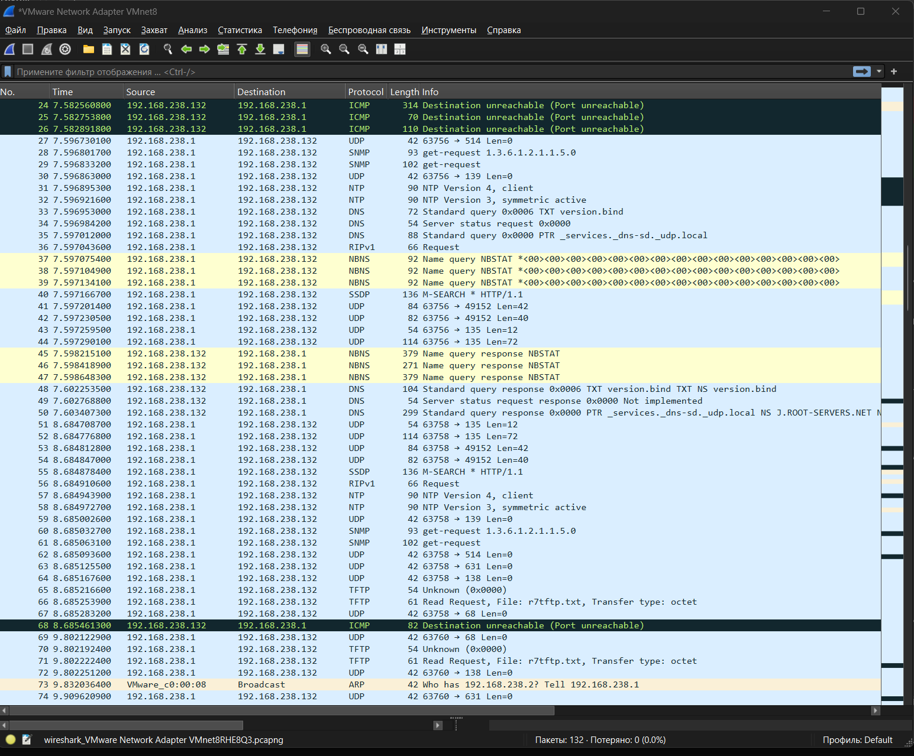
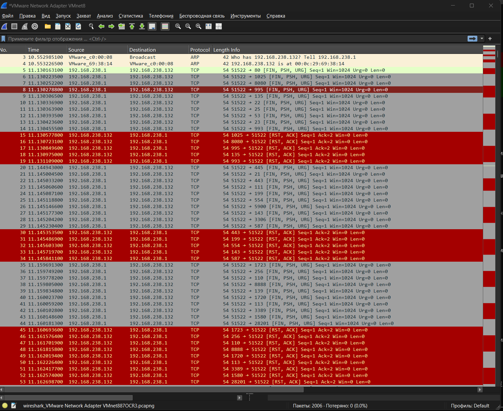

# Домашнее задание к занятию «Уязвимости и атаки на информационные системы»

## Выполнил
Даниил Соколов

---

# Задание 1

## Сканирование Metasploitable

Была развернута виртуальная машина Metasploitable 2 с IP-адресом:

```text
192.168.238.132
```

Для определения сетевых служб использовалась команда:

```bash
nmap -sV 192.168.238.132
```

### Обнаруженные сетевые службы

| Порт | Сервис | Версия |
|--------|---------|---------|
| 21 | FTP | vsftpd 2.3.4 |
| 22 | SSH | OpenSSH 4.7p1 |
| 23 | Telnet | Linux telnetd |
| 25 | SMTP | Postfix |
| 53 | DNS | ISC BIND 9.4.2 |
| 80 | HTTP | Apache 2.2.8 |
| 139 | NetBIOS | Samba |
| 445 | SMB | Samba |
| 3306 | MySQL | MySQL 5.0.51a |
| 5432 | PostgreSQL | PostgreSQL 8.3 |
| 5900 | VNC | VNC |
| 8180 | HTTP | Apache Tomcat |

### Обнаруженные уязвимости

#### 1. VSFTPD 2.3.4 Backdoor

Сервис:

```text
vsftpd 2.3.4
```

Уязвимость позволяет получить удалённый доступ к системе через встроенный бэкдор.

Источник:

https://www.exploit-db.com/exploits/17491

---

#### 2. Samba Username Map Script

Сервис:

```text
Samba 3.x
```

Уязвимость позволяет выполнить произвольный код удалённо.

Источник:

https://www.exploit-db.com/exploits/16320

---

#### 3. UnrealIRCd Backdoor

Сервис:

```text
UnrealIRCd
```

Содержит встроенный бэкдор для удалённого выполнения команд.

Источник:

https://www.exploit-db.com/exploits/13853

---

# Задание 2

## SYN Scan

Команда:

```bash
nmap -sS 192.168.238.132
```

Особенности:

- отправляется TCP SYN пакет;
- соединение полностью не устанавливается;
- открытый порт отвечает SYN/ACK;
- считается наиболее быстрым видом сканирования.

---

## FIN Scan

Команда:

```bash
nmap -sF 192.168.238.132
```

Особенности:

- отправляется TCP FIN пакет;
- открытые порты обычно не отвечают;
- закрытые порты отвечают RST;
- используется для обхода простых фильтров.

---

## XMAS Scan

Команда:

```bash
nmap -sX 192.168.238.132
```

Особенности:

- отправляются пакеты с установленными флагами FIN, PSH и URG;
- позволяет выявлять открытые порты на некоторых ОС;
- может обходить простые системы фильтрации.

---

## UDP Scan

Команда:

```bash
nmap -sU --top-ports 20 192.168.238.132
```

Особенности:

- проверяются UDP-службы;
- обнаружены открытые UDP-порты:
  - 53/udp (DNS)
  - 137/udp (NetBIOS)
- часть портов определена как open|filtered.

---

## Отличия режимов сканирования

| Тип | Особенность |
|-------|-------------|
| SYN | Быстрое полуоткрытое сканирование |
| FIN | Использует FIN-пакеты |
| XMAS | Использует FIN+PSH+URG |
| UDP | Проверяет UDP-службы |

## Как отвечает сервер

- SYN Scan — отвечает SYN/ACK для открытых портов.
- FIN Scan — закрытые порты отвечают RST.
- XMAS Scan — реакция аналогична FIN Scan.
- UDP Scan — открытые порты обычно отвечают данными сервиса или не отвечают вовсе, закрытые возвращают ICMP Port Unreachable.

---

## Вывод

В результате сканирования Metasploitable были обнаружены многочисленные открытые сетевые сервисы и известные уязвимости. Также были изучены различные режимы сканирования Nmap и особенности сетевого трафика при их использовании.









